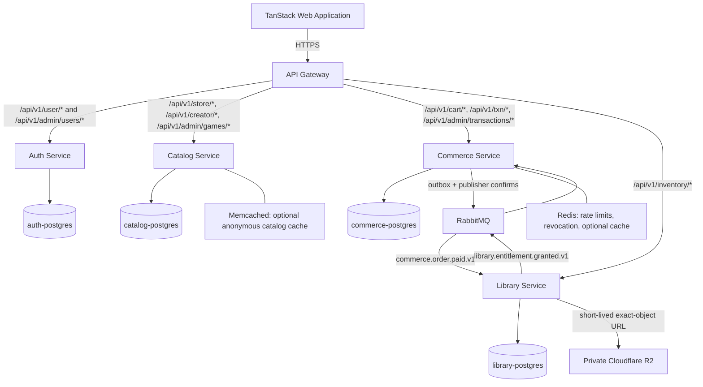

# Hathor: Distributed Microservices Architecture & Execution Blueprint

> **Status:** Approved architecture baseline for the August 15, 2026 vertical slice.

> **Canonical detail:** This master blueprint summarizes the approved design. Binding contracts and operational detail live in `docs/adr/`, `docs/contracts/`, `docs/security/`, `docs/reliability/`, `docs/architecture/`, and `docs/delivery/`.

## 1. Product And Release Scope

Hathor is a MENA digital game-distribution platform. It removes international-card friction through local-payment-shaped flows, localized EGP pricing, and a creator-controlled Store Page Designer inspired by itch.io.

The August release is a secure distributed vertical slice. A gamer can register, authenticate, browse seeded games, create an order, complete a simulator payment, receive a durable license grant, and request a verified download of a seeded game build. A creator can create drafts and safely customize an owned store page. An administrator can manage roles, moderate game publication, and inspect transaction records.

### Included

1. Gateway, auth, catalog, commerce, and library microservices.
2. Four independent PostgreSQL instances locally, one owned by each domain service.
3. RS256 user sessions, rotating refresh tokens, role enforcement, and internal service tokens.
4. Seeded public catalog, constrained theme designer, local AI theme proposal capability, cached non-personalized recommendations, and creator draft workflow.
5. Cart, server-authoritative checkout quote, three branded payment simulator flows, payment audit, transactional outbox, RabbitMQ, and idempotent library fulfillment.
6. Private Cloudflare R2 seeded ZIP artifact, short-lived exact-object access, and SHA-256 verification.
7. Admin bootstrap, role workflow, moderation, audit records, testing, recovery runbooks, and local Docker Compose demonstration.

### Deferred

1. Live Fawry, Vodafone Cash, and InstaPay settlement.
2. Creator build uploads, malware scanning, chunking, delta patching, and a desktop launcher.
3. Arbitrary CSS/HTML, custom JavaScript, or untrusted embeds in store themes.
4. AI buyer assistants, behavioral personalization, semantic search, and behavioral profiling.
5. High availability, multi-region deployment, sharding, and production-scale CDN controls.

## 2. Architecture Principles

1. **Independently deployable services:** Gateway, auth, catalog, commerce, and library run as separate processes and containers.
2. **Database per service:** No cross-database foreign keys, reads, joins, migrations, or shared runtime credentials.
3. **Gateway is not a trust authority:** Every service verifies user JWTs and authorizes business actions itself.
4. **RabbitMQ is the only durable domain-event transport:** Redis Pub/Sub is prohibited for payment, entitlement, and release events.
5. **At-least-once delivery, exactly-once entitlement effect:** Commerce uses an outbox and library uses an inbox/processed-event ledger.
6. **Server authority over payment facts:** The browser cannot set price, discounts, order totals, payment references, or order state.
7. **Private by default:** Only web and gateway are exposed. Services, databases, caches, broker, and management ports remain internal.
8. **Schema-constrained creativity:** Creator themes and AI output are data validated against a fixed DSL, not executable presentation code.
9. **Local first:** The full topology runs through Docker Compose locally before a VPS is available. Public staging later reuses the same images and topology.
10. **Contracts before implementation:** OpenAPI, AsyncAPI, runtime validation, and contract tests govern service integration.

## 3. System Topology



### Public Route Ownership

| Route namespace | Owner | Access policy |
| --- | --- | --- |
| `/api/v1/user/*` | Auth | Public registration/login; caller-scoped account operations |
| `/api/v1/store/*` | Catalog | Public published-game browse/detail |
| `/api/v1/cart/*` | Commerce | Authenticated caller's cart only |
| `/api/v1/txn/*` | Commerce | Authenticated caller's orders; HMAC-protected webhook ingress |
| `/api/v1/inventory/*` | Library | Authenticated caller's licenses/downloads only |
| `/api/v1/creator/*` | Catalog | Creator-owned game drafts only |
| `/api/v1/admin/users/*` | Auth | Admin only |
| `/api/v1/admin/games/*` | Catalog | Admin only |
| `/api/v1/admin/transactions/*` | Commerce | Admin only |

`gameId` is the canonical UUID name throughout public APIs, internal APIs, events, and data models. `appId` is not used by this release.

## 4. Service Responsibilities

| Service | Owns | Required protections |
| --- | --- | --- |
| API Gateway | TLS edge, CORS, rate limits, request IDs, request limits, route proxying | Does not authorize domain actions or access service databases |
| Auth | Users, passwords, roles, refresh tokens, user JWTs, service tokens, JWKS, role audit | Argon2, rotating token families, Turnstile registration verification, admin bootstrap |
| Catalog | Games, tags, EGP pricing, publication state, creator ownership, themes, build metadata | Ownership checks, constrained theme schema, admin-only publication/moderation |
| Commerce | Carts, catalog quote snapshots, orders, payment events, payment state, outbox, transaction audit | Idempotency, raw-body HMAC, replay protection, conditional transitions |
| Library | Licenses, wishlists, inbox ledger, entitlement audit, ownership check, download authorization | Idempotent event handling, entitlement/object state validation |

## 5. Identity, Authentication, And Authorization

### User Sessions

`auth-service` signs short-lived RS256 access JWTs. Required claims are:

```text
iss, aud, sub, roles, iat, nbf, exp, jti, kid, authorizationVersion
```

Services validate a fixed `RS256` algorithm, `kid`, issuer, audience, expiry, time bounds, and authorization version. JWKS is cached by `kid`, refreshed on unknown keys and bounded TTL, and supports active/retiring signing keys.

Access tokens are held in browser memory only. Refresh tokens are opaque, stored only as hashes, rotated on each use, and sent in `HttpOnly`, `Secure`, `SameSite=Lax` cookies scoped to the refresh path. Refresh-token reuse revokes the token family. Logout, password reset, account disablement, role removal, and incident response invalidate relevant session/authorization versions.

Public registration always grants `gamer` only. It is protected by account/IP rate limits and Cloudflare Turnstile validation. The first administrator is created through a one-time secret-gated command; subsequent creator/admin grants occur through audited admin APIs.

### Internal Service Identity

Internal routes are private and require separate auth-issued service JWTs. A service token lasts five minutes and has:

```text
iss, sub=<calling service>, aud=<target service>, scope, exp, jti, kid
```

Examples:

| Caller | Callee | Scope | Purpose |
| --- | --- | --- | --- |
| Commerce | Catalog | `catalog.quote.read` | Authoritative sellability and price quote |
| Commerce | Library | `library.ownership.read` | Reject games already owned by the buyer |
| Library | Catalog | `catalog.build.read` | Resolve a published immutable build |

The browser cannot call `/internal/*` paths. Services fail closed with a retryable dependency error when a required quote, ownership, or build lookup cannot be obtained.

## 6. Data Ownership And Invariants

Each service runs one PostgreSQL container and uses a unique non-superuser role. The complete binding data design is in `docs/data/service-data-model.md`.

### Auth Database

- `users`: normalized email, Argon2 hash, roles, account state, authorization version.
- `refresh_token_families` and `refresh_tokens`: hashes, expiry, rotation, revocation, reuse detection.
- `role_change_audit`: actor, target, change, authorization versions, correlation ID, timestamp.

### Catalog Database

- `games`, tags, game tags, publication transitions, approved theme documents, and creator ownership.
- `builds`: game ID, version, private R2 object key, SHA-256, state, and publication/revocation timestamps.
- New games default to `draft`; only admins move a game to `published` or `suspended`.

### Commerce Database

- `cart_items`: authoritative cart state and cart version.
- `orders`: order state, idempotency key, payment method/reference, provider transaction ID, EGP total, currency, expiry, and timestamps.
- `order_items`: immutable game ID, title, quote ID, price version, unit price, discount snapshot, currency, and line total.
- `payment_events`, `order_state_transitions`, and `outbox_events`: payment evidence, audit history, and reliable publication state.

### Library Database

- `processed_events`: unique inbox event IDs.
- `user_licenses`: user/game ownership with source order, fulfillment event, paid price/currency, and revocation fields.
- `entitlement_audit`: grants, revocations, and download-authorization evidence.

All money remains `NUMERIC(12,2)` in the database and decimal strings in HTTP/events. The release currency is `EGP`. Status, payment method, discount range, non-negative money, provider-event uniqueness, and idempotency keys use database constraints.

## 7. Payment And Entitlement Guarantee

### Order State Machine

```text
created -> payment_pending -> payment_confirmed -> fulfillment_pending -> fulfilled
payment_pending -> expired | payment_failed | cancelled
fulfilled -> revoked
```

All transitions are conditional and monotonic inside PostgreSQL transactions. The expiry worker may expire a `payment_pending` order but cannot override a confirmed payment.

### Checkout Initialization

`POST /api/v1/txn/init` requires an `Idempotency-Key`. Commerce:

1. Verifies the caller JWT.
2. Locks the authoritative cart.
3. Obtains a scoped internal catalog quote.
4. Obtains a scoped library ownership check.
5. Rejects unavailable, suspended, unpublished, or already-owned games.
6. Persists immutable order-item snapshots and a `payment_pending` order.
7. Returns the original order for an identical retry.

### Simulator Provider

The user can select branded Fawry, Vodafone Cash, or InstaPay simulator instructions, then request only a `paid` or `failed` simulator result for their own non-expired pending simulator order. The browser never sends a total, reference, callback timestamp, or arbitrary order state.

The server-side simulator generates a provider-shaped callback. Commerce preserves the exact raw body before parsing and validates HMAC in constant time, signature/timestamp freshness, provider event ID uniqueness, merchant ID, payment reference, method, amount, currency, and allowed transition. Simulator functionality is enabled only in `demo` or `test` environments.

### Outbox And Inbox

```text
Commerce transaction
  -> lock order and verify payment event
  -> insert unique payment receipt
  -> payment_confirmed -> fulfillment_pending
  -> append state audit
  -> insert commerce.order.paid.v1 into outbox_events
  -> commit

Outbox worker
  -> publish persistent event to RabbitMQ
  -> wait for publisher confirm
  -> mark outbox row published

Library transaction
  -> insert event ID into processed_events
  -> grant source-order licenses and audit records
  -> insert library.entitlement.granted.v1 into local outbox
  -> commit
  -> acknowledge RabbitMQ only after commit
```

Duplicate callbacks or RabbitMQ deliveries are expected and safe. Duplicate event IDs produce no second license effect. Commerce consumes entitlement acknowledgment idempotently and moves `fulfillment_pending` to `fulfilled`.

RabbitMQ uses durable exchanges/queues, persistent messages, publisher confirms, five exponential-backoff retries, DLQ routing, and persistent storage. Daily reconciliation finds overdue outbox rows, paid orders without licenses, and licenses without valid source orders. Repair/replay follows the runbooks; no uncorrelated manual license grants are allowed.

## 8. Caching And Messaging

| Technology | Approved role | Prohibited role |
| --- | --- | --- |
| RabbitMQ | Durable payment, entitlement, and release events | Source-of-truth business state |
| Redis | Gateway rate limits, short-lived revocation data, optional disposable cache | Payment events, durable carts, orders, licenses |
| Memcached | Optional anonymous catalog browse/detail cache after correctness tests | Authenticated responses, authorization, carts, signed URLs |
| PostgreSQL | Authoritative service-local business data | Cross-service shared database |

Catalog cache invalidation is required for game, price, tag, theme, and publication-state changes. PostgreSQL remains authoritative when any cache is unavailable.

## 9. Store Page Designer And AI

The designer stores a versioned theme DSL, not raw CSS:

```json
{
  "schemaVersion": 1,
  "palette": { "background": "#111827", "surface": "#1F2937", "text": "#F9FAFB", "accent": "#F97316" },
  "typography": { "headingFont": "cairo", "bodyFont": "inter", "headingScale": "large" },
  "layout": { "template": "cinematic", "heroAlignment": "left", "cardStyle": "elevated", "showTrailer": true },
  "contentOrder": ["hero", "description", "screenshots", "systemRequirements"]
}
```

Only allowlisted colors, bundled fonts, layouts, visibility flags, and known sections are accepted. Raw CSS, HTML, JavaScript, SVG markup, external fonts, arbitrary URL resources, `@import`, selectors, and iframe markup are rejected.

The optional AI designer is a catalog-service provider adapter. It receives minimal creator-owned draft context and returns only validated JSON Patch proposals. The flow is:

```text
creator prompt -> ownership check -> AI proposal -> schema validation -> preview/diff
-> explicit creator acceptance -> draft revision -> admin publication workflow
```

AI cannot publish, suspend, price, upload, download, process payment, grant licenses, assign roles, access another creator's game, or execute database/broker/storage operations. Manual designer functionality remains available if no OpenAI key is configured.

## 10. Seeded Build Delivery

The release uses trusted team-seeded immutable ZIP artifacts in a private Cloudflare R2 bucket. Creator uploads are not enabled.

1. Catalog records an immutable object key, build version, game ID, publication state, and SHA-256.
2. Library validates caller entitlement, game state, and published build state.
3. Library signs one exact R2 object URL for 60-120 seconds.
4. The download response includes the SHA-256; the web download experience verifies or reports integrity verification.

R2 bucket listing, public ACLs, wildcard prefixes, public object URLs, and browser-selected object keys are prohibited. Previously issued signed URLs are bearer credentials until expiry; immediate revocation of an already-issued URL is deferred to a future authorization edge.

## 11. Local-First Deployment And Operations

### Local Compose

The first operational target is a clean local Docker Compose environment with web, gateway, four domain services, four PostgreSQL instances, RabbitMQ, Redis, and Memcached. Only web/gateway publish host ports by default. The environment must support reproducible migrations, seed data, health/readiness checks, contract validation, integration tests, and end-to-end failure tests.

### Future Deployment (Deferred)

VPS/public deployment is outside the August release because hosting is not budgeted. When deployment is reconsidered after release, the same images and topology should deploy to one hardened VPS:

- Caddy terminates TLS; only ports 80/443 and restricted key-only SSH are reachable.
- Internal services, broker, cache, PostgreSQL, and RabbitMQ management have no public bindings.
- Secrets are injected outside source control.
- Persistent volumes exist for all databases and RabbitMQ.
- Cloudflare R2, Turnstile, signing, broker, database, and backup credentials remain private.
- Encrypted nightly off-host backups retain 14 days of database and release metadata.
- A restore drill validates user, order, license source order, build metadata, and artifact SHA-256 relationships.

Every service exposes `/health/live` and `/health/ready`. Logs are structured and include a correlation ID while excluding passwords, JWTs, callback bodies, payment secrets, and signed URLs. Required signals include HTTP errors/latency, database health, outbox age, publish failures, queue depth, retries, DLQ depth, payment transitions, and entitlement failures.

## 12. Contracts, Testing, And Release Gates

### Contract Sources

| Contract | Location |
| --- | --- |
| Public HTTP API | `docs/contracts/public-api.openapi.yaml` |
| Internal service API | `docs/contracts/internal-api.openapi.yaml` |
| RabbitMQ events | `docs/contracts/domain-events.asyncapi.yaml` |
| Runtime/CI policy | `docs/contracts/validation-policy.md` |
| Data model | `docs/data/service-data-model.md` |

Every HTTP handler validates request data at runtime. Every RabbitMQ publisher and consumer validates event payloads. Contract changes are reviewed before code changes and breaking event changes require a new event version.

### Release-Blocking Tests

1. Registration cannot create creator/admin accounts and validates Turnstile.
2. JWTs with invalid algorithm, key ID, issuer, audience, expiry, or authorization version are rejected.
3. Creator and gamer IDOR attempts fail; admins alone can grant roles, moderate games, and read transactions.
4. Duplicate checkout initialization returns one order.
5. Browser-supplied price, discount, total, reference, or state cannot alter payment facts.
6. Duplicate, stale, tampered, wrong-amount, and wrong-reference callbacks do not complete an order.
7. Commerce restart after payment commit and RabbitMQ outage do not lose eventual entitlement.
8. Library restart and duplicate event delivery create exactly one license effect.
9. DLQ replay and daily reconciliation repair only correlated source events/orders.
10. Unowned, suspended, revoked, or mismatched download requests fail; seeded ZIP integrity is verified.
11. Theme/content injection, CORS, CSRF, and internal-route access attempts fail safely.
12. Backup restore recovers the required cross-service audit relationships.

## 13. Delivery Plan

| Milestone | Dates | Exit condition |
| --- | --- | --- |
| M0: Architecture freeze | July 23-24 | Contracts, security, data, reliability, scope, and AI constraints approved |
| M1: Local platform/auth | July 25-28 | Clean Compose supports register, login, protected `/me`, and catalog browse |
| M2: Catalog/cart/order | July 29-August 1 | Gamer creates exactly one valid payment-pending order from a quote |
| M3: Payment/entitlement | August 2-6 | Verified simulator payment grants exactly one license after retry/restart |
| M4: R2/creator/admin/AI | August 7-10 | Owned seeded build access, creator/admin controls, AI proposals, and cached recommendations work locally |
| M5: Integration/recovery | August 11-13 | E2E, fault, reconciliation, DLQ, and restore paths pass locally |
| M6: Release hardening | August 14-15 | Feature freeze, release candidate, rehearsal, and final sign-off complete |

The detailed issue order, owners, dependencies, acceptance criteria, labels, and board views are maintained in `GitHub_Projects_Fullstack_Plan.md`.

## 14. Governing Documents

| Topic | Source |
| --- | --- |
| Architecture decisions | `docs/adr/ADR-001-august-vertical-slice.md` |
| System and VPS topology | `docs/architecture/system-architecture.md`, `docs/architecture/vps-deployment.md` |
| AI designer guardrails | `docs/architecture/ai-designer.md` |
| Security | `docs/security/security-architecture.md` |
| Payment/entitlement reliability | `docs/reliability/payment-entitlement.md`, `docs/reliability/payment-entitlement-sequence.md` |
| Operations | `docs/runbooks/` |
| Delivery | `docs/delivery/implementation-roadmap.md`, `docs/delivery/issue-dependencies.md` |
