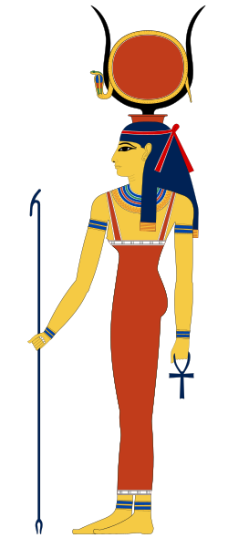

# Hathor Documentation

| Field        | Value                                  |
| ------------ | -------------------------------------- |
| Version      | 1.0                                    |
| Type         | Game Distribution & Developer Platform |
| Last Updated | July 2026                              |

  

> Hathor is a major ancient Egyptian goddess who personified motherhood, joy, love, music, and the sky.

## Project Overview

Hathor is a multi-role game distribution platform designed around three core user groups:

- Gamers: browse, purchase, and play games.
- Game Creators: upload, manage, and monetize their games.
- Admins: oversee users, developers, games, and platform operations.

The platform supports dual-role accounts. For example, a Game Creator can also use the platform as a Gamer to browse and purchase games.

## Roles and Access

| Role         | Access                                                                             |
| ------------ | ---------------------------------------------------------------------------------- |
| Guest        | Home, Game Details, Authentication                                                 |
| Gamer        | Public pages plus Wishlist, Library, Cart, Checkout, and Profile                   |
| Game Creator | Gamer access when applicable, plus Developer Dashboard, Create Game, and Edit Game |
| Admin        | Admin Panel for Users, Developers, Games, and Payments, plus Profile               |

## Information Architecture

### Public Area

- Home Page
  - Featured Games
  - Discounted Games
  - AI Recommendations
- Game Details
  - Reviews
  - System Requirements
  - Pricing
- Authentication
  - Login
  - Register

### Gamer Dashboard

- Wishlist
- Library
  - Games
    - Reviews
    - System Requirements
    - Pricing
- Cart
  - Checkout
- Profile

### Developer Dashboard

- Dashboard
  - Create Game
    - Upload Your Game
      - Custom Web Page
      - AI Agent integration
  - Edit Game
- Profile

### Admin Panel

- Dashboard
  - Users
  - Developers
  - Games
  - Payments
- Profile

## Key Product Notes

- Profile is role-aware rather than a single flat page; each role should surface only relevant settings and shortcuts.
- Game Details and Library > Games share the same content structure and should reuse the same component template.
- Cart > Checkout is a linear flow and should be designed as a guided sequence.
- Create Game > Upload Your Game is the most complex flow and should be treated as a dedicated product surface.
- AI appears in two places: personalized recommendations on the Home Page and an assistant on the custom game page.

## Brand Guidelines

| Swatch                                                                                                      | Color          | Hex     | Usage                                      |
| ----------------------------------------------------------------------------------------------------------- | -------------- | ------- | ------------------------------------------ |
|  | Primary Dark   | #222831 | Base backgrounds and dark surfaces         |
|  | Secondary Dark | #393E46 | Cards, panels, navbars, and sidebars       |
|  | Accent         | #FD7014 | Primary CTA, highlights, and active states |
|  | Light          | #EEEEEE | Primary text on dark backgrounds           |

Use the dark palette as the foundation, reserve the accent color for high-priority actions and emphasis, and keep typography and spacing consistent across all surfaces.
