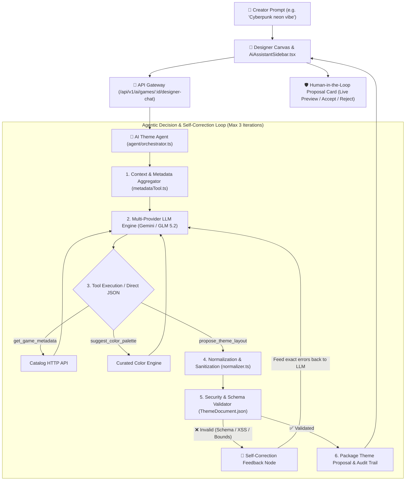

# Agentic AI Storefront Theme Designer Architecture

## Role & Scope

The **Agentic AI Storefront Theme Designer** is an autonomous AI assistant operating inside `ai-service` that empowers game creators to design, style, and structure custom store pages.

Unlike single-shot chatbots or RAG retrieval systems, it executes an **autonomous multi-turn reasoning and self-correction loop** equipped with tool-calling, multi-provider LLM hot-swapping, AST normalization, and Human-in-the-Loop (HITL) approval.

---

## 1. System Architecture & Information Flow



---

## 2. Modular Code Structure

The implementation is modularized under `apps/ai-service/src/services/agent/`:

```
apps/ai-service/src/services/agent/
├── index.ts                 # Clean public API entrypoint
├── types.ts                 # AgentChatInput, AgentChatResponse, AgentChatMessage
├── orchestrator.ts          # Multi-turn self-correction loop & extractJsonPayload
├── normalizer.ts            # normalizeThemeSections & envelope unwrapping
├── prompt.ts                # Embedded system instructions & dynamic prompt builders
├── AgentPrompt.md           # Canonical 16KB 18-component specification & layout rules
│
├── tools/                   # Autonomous Agent Tool Registry
│   ├── index.ts             # Tool dispatcher & executeAgentTool router
│   ├── declarations.ts      # Tool JSON schemas for Gemini/OpenRouter
│   ├── metadataTool.ts      # get_game_metadata (HTTP client to catalog-service)
│   ├── paletteTool.ts       # suggest_color_palette & preset definitions
│   ├── validationTool.ts    # validate_theme_schema against ThemeDocument
│   └── proposalTool.ts      # propose_theme_layout & proposal packaging
│
└── providers/               # Swappable LLM Adapters
    ├── index.ts             # Provider exports
    ├── geminiProvider.ts    # Google Gemini client & multi-model fallback
    └── glmProvider.ts       # OpenRouter / GLM 5.2 client & retry logic
```

---

## 3. The 6 Core Execution Nodes

### 3.1. Context & Metadata Aggregator Node
* **Location**: `orchestrator.ts`, `tools/metadataTool.ts`, & `prompt.ts`
* **Responsibilities**:
  1. Calls `catalog-service` HTTP endpoint (`/creator/games/:id` or `/store/games/:id`) via `get_game_metadata` to retrieve draft game title, genre, tags, and screenshots.
  2. Detects intent: distinguishes between full page generation vs incremental modifications (e.g. *"only change button color"* or *"keep my layout"*).
  3. Gathers active editor canvas state (`currentTheme`) and conversation history.
  4. **Embedded System Specification**: `prompt.ts` embeds the complete 16KB system specification (`AgentPrompt.md`) containing all 18 component definitions directly in TypeScript, guaranteeing 100% prompt availability across Docker containers and build runtimes.

---

### 3.2. Multi-Provider LLM Orchestrator (with Hot-Swapping)
* **Location**: `providers/geminiProvider.ts` & `providers/glmProvider.ts`
* **Responsibilities**:
  * Supports **Google Gemini** (`gemini-2.5-flash`, `gemini-2.0-flash`) and **Zhipu / OpenRouter GLM 5.2** (`z-ai/glm-5.2:free`).
  * **Autonomous Hot-Swapping**: If the primary provider encounters rate limits (HTTP 429), quota exhaustion (HTTP 402), or network failure, the orchestrator automatically hot-swaps mid-turn to the secondary engine without crashing the creator's session.
  * **Robust JSON Extraction (`extractJsonPayload`)**: Strips markdown code fences (````json ... ````) and isolates outermost JSON objects before parsing.

---

### 3.3. Tool Calling Registry (`tools/`)
The agent can invoke 4 registered tools:
1. **`get_game_metadata(gameId)`**: Fetches official game details from `catalog-service`.
2. **`suggest_color_palette(themeStyle)`**: Selects curated high-contrast palettes (Cyberpunk, Egyptian Gold, Dark Gothic, Retro Synthwave, Emerald Forest, etc.).
3. **`validate_theme_schema(themeJson)`**: Evaluates candidate themes against the `ThemeDocument.json` specification.
4. **`propose_theme_layout(theme, changeSummary, explanation)`**: Finalizes the theme structure with a change summary and user explanation.

---

### 3.4. Normalization & AST Sanitization Node (`normalizer.ts`)
* **Unwrapping**: Strips all nested envelope shapes returned by LLMs (`theme.proposedTheme`, `theme.theme`, `theme.layout`, `parameters.theme`, `arguments.theme`, `args.theme`).
* **Indexed Map Extraction**: Automatically normalizes numeric key dictionaries (e.g. `{ '0': {...}, '1': {...} }`) into clean arrays.
* **Component Alias Mapping**: Maps colloquial aliases (e.g. `'hero'`, `'specs'`, `'about'`) to canonical component types (`'media-carousel'`, `'system-reqs'`, `'about-game'`).
* **Scrubbing**: Removes misplaced arrays (e.g. `reviews` inside a media carousel) and strips hardcoded catalog fields (since catalog data is dynamically rendered).

---

### 3.5. Schema Validation & Autonomous Self-Correction Loop
* **Location**: `themeValidator.ts` & `orchestrator.ts`
* **Deep Security Scan**:
  * **XSS Defense**: Regex checks prohibit `<script>`, inline JavaScript event handlers, and `javascript:` URLs in text and images.
  * **CSS Injection Defense**: Prohibits CSS `expression()`, `@import`, and raw `style` tags.
  * **SQL Injection Defense**: Detects and rejects SQL patterns (`UNION SELECT`, `--`).
* **Zero-Section Defense**: If the LLM generates a response with 0 sections, the orchestrator rejects it and commands an autonomous self-correction turn: *"Your proposal contained 0 sections. You MUST assemble a full-page storefront layout with 4-8 rich sections"*.
* **Autonomous Self-Correction**: If schema validation fails, the validator returns exact error paths (e.g. `sections[2].titleColor`). The orchestrator feeds these errors back to the model as user feedback, forcing the agent to self-correct (up to 3 iterations) before finalizing.

---

### 3.6. Human-in-the-Loop (HITL) Proposal & Live Canvas
* **Location**: `AiAssistantSidebar.tsx` & `DesignerPage.tsx`
* **Zero Direct Mutation**: The AI agent **never** writes directly to the catalog database.
* **Interactive Proposal Card**: The client displays a proposal card showing:
  * `actionsTaken`: Transparent audit trail of the agent's actions.
  * `changeSummary`: 2–4 bullet points of visual modifications.
  * `proposedTheme`: The structured JSON layout.
* **Creator Governance**: The creator can **Live Preview** the proposal directly on the designer canvas, click **Accept** to apply it to editor state, or click **Reject** to discard. Database persistence occurs only when the creator explicitly clicks "Save Draft" or "Publish".

---

## 4. Theme DSL Schema Specification

Themes are structured purely as declarative JSON adhering to the `ThemeDocument.json` specification:

```json
{
  "pageSettings": {
    "bg": "linear-gradient(135deg, #0f051d 0%, #1a0933 100%)",
    "titleFont": "'Cinzel', serif",
    "textFont": "'Raleway', sans-serif",
    "accentColor": "#ff007f",
    "containerWidth": 1240,
    "padTop": 0,
    "padBottom": 40
  },
  "sections": [
    {
      "id": "sec-1",
      "type": "media-carousel",
      "carouselHeight": 480,
      "showThumbnails": true,
      "carouselImages": ["https://cdn.example.com/screenshot1.jpg"]
    },
    {
      "id": "sec-2",
      "type": "game-header",
      "headerBg": "linear-gradient(90deg, #1a0933 0%, #0f051d 100%)",
      "headerBorder": "1px solid #353c4d",
      "titleColor": "#ff007f",
      "descColor": "#ffffff"
    },
    {
      "id": "sec-3",
      "type": "grid",
      "gridTemplate": "2:1",
      "gridGap": 32,
      "gridCols": [
        {
          "id": "col-left",
          "elements": [
            { "id": "elem-about", "type": "about-game", "aboutBg": "transparent" },
            { "id": "elem-reqs", "type": "system-reqs", "reqsBg": "#14141a" }
          ]
        },
        {
          "id": "col-right",
          "elements": [
            { "id": "elem-cta", "type": "sidebar-cta", "sidebarBg": "#1a0933" },
            { "id": "elem-info", "type": "sidebar-info", "infoBg": "#14141a" }
          ]
        }
      ]
    }
  ]
}
```

---

## 5. API Endpoints & Contracts

### 5.1. Designer Chat Endpoint
* **Path**: `POST /api/v1/ai/games/:id/designer-chat`
* **Headers**: `Authorization: Bearer <creator-jwt>`
* **Request Body**:
  ```json
  {
    "message": "Design a dark synthwave cyberpunk storefront with neon pink accents",
    "currentTheme": { "pageSettings": {}, "sections": [] },
    "conversationHistory": [
      { "role": "user", "content": "Hello" },
      { "role": "model", "content": "Hi! How can I help with your store theme?" }
    ],
    "provider": "auto"
  }
  ```
* **Response Body**:
  ```json
  {
    "reply": "Here is the custom Cyberpunk Neon Synthwave theme layout designed for your game.",
    "proposedTheme": { "pageSettings": { ... }, "sections": [ ... ] },
    "changeSummary": [
      "Assembled full-page storefront layout with 5 sections",
      "Configured theme palette: accent #ff007f, bg linear-gradient(...)",
      "Populated narrative lore, feature matrices, and sidebar purchase widgets"
    ],
    "actionsTaken": [
      "Selected primary AI engine: GEMINI",
      "Loaded game profile: Cyber Shadow",
      "Executed suggest_color_palette tool for 'cyberpunk'",
      "Theme proposal finalized via propose_theme_layout (5 sections)"
    ],
    "providerUsed": "gemini"
  }
  ```

---

## 6. Security Invariants & Guardrails

| Guardrail | Enforcement Mechanism |
| :--- | :--- |
| **No Database Writes** | The AI agent has zero database-write permissions. It cannot save or publish games. |
| **No Arbitrary Code Execution** | Theme output is pure JSON. The frontend renders predefined React components (`PureJsonRenderer.tsx`). |
| **Non-Editable Price Defense** | Commercial properties (`sidebarPrice`, `sidebarDiscount`) are strictly non-editable and emit validation warnings if tampered with. |
| **Human-in-the-Loop** | Themes are only committed when the creator reviews and explicitly clicks "Save Draft". |
