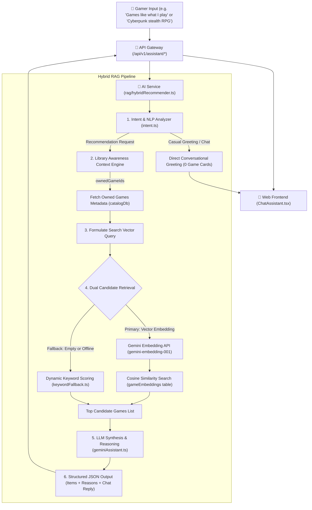

# RAG & Discovery Chat Assistant Architecture

## Role & Scope

The **Hathor Discovery Chat Assistant** provides conversational game discovery, personalized recommendations, and library-aware suggestions for players across the Hathor platform. It operates inside `ai-service` and utilizes a **Hybrid Retrieval-Augmented Generation (RAG)** architecture combining vector embeddings, catalog metadata, library awareness, and conversational synthesis.

The assistant is strictly read-only and has **zero authority** over database writes, cart mutations, or purchase executions.

---

## 1. System Architecture & Information Flow



---

## 2. Modular Code Structure

The implementation is modularized under `apps/ai-service/src/services/rag/`:

```
apps/ai-service/src/services/rag/
├── index.ts                 # Clean public API entrypoint
├── types.ts                 # RecommendationItem, RecommendationResult, GeminiFlashResponse
├── intent.ts                # Intent classification, greeting detector, stopword filters
├── vectorUtils.ts           # Cosine similarity math, SHA-256 hashes, Gemini embeddings
├── geminiAssistant.ts       # Gemini Flash synthesis, prompt template & HTTP retry engine
│
├── retrieval/               # Isolated Candidate Retrieval Engines
│   ├── index.ts             # Retrieval engine exports
│   ├── vectorRetrieval.ts   # retrieveVectorCandidates (pgvector & cosine ranking)
│   └── keywordFallback.ts   # getDynamicKeywordFallback (keyword scoring & stopword filtering)
│
└── hybridRecommender.ts     # Core getHybridRecommendations pipeline orchestrator
```

---

## 3. Core Architectural Subsystems

### 3.1. Intent Detection & Stopword Filtering (`intent.ts`)
* **Stopwords & Boilerplate Filtering**: Over 180 conversational filler words (e.g. *"recommend"*, *"looking for"*, *"please"*, *"game"*) are filtered out to isolate high-signal search tokens.
* **Greeting / Casual Chat Detection (`isCasualGreetingOrChat`)**: Identifies pure greetings (*"hi"*, *"hello"*, *"who are you"*) so the assistant responds conversationally **without attaching irrelevant game cards**.
* **Library Intent Detection (`isLibraryRecommendationIntent`)**: Detects phrases like *"games like what I play"*, *"based on my library"*, or *"what I own"*.

---

### 3.2. Library Awareness Context Engine
* The assistant accepts `ownedGameIds` passed securely from the client (resolved from `library-service`).
* **Empty Library Handling**: If a user with 0 games asks for library-based recommendations, the assistant politely explains that the library is empty and invites the user to name favorite genres (Cyberpunk, RPG, Stealth, etc.).
* **Library Context Injection**: When games are owned, their titles and descriptions are aggregated into a player profile string (e.g., `'"Cyberpunk Odyssey" (Sci-fi stealth action), "Shadow Blade" (Ninja RPG)'`), and the query is reformulated into:
  ```
  "Games similar to player library favorites: <ownedSummaryStr>"
  ```
* **Ownership Exclusion**: Games already owned by the player are strictly excluded from candidate recommendations.

---

### 3.3. Dual Candidate Retrieval Engine (`retrieval/`)

#### Primary Engine: Vector Embeddings (`vectorRetrieval.ts`)
1. Generates dense vector embeddings via Google Gemini (`gemini-embedding-001` or `text-embedding-004`).
2. Calculates cosine similarity across pre-computed vector embeddings in `catalog_db.game_embeddings`:
   $$\text{similarity} = \frac{\mathbf{u} \cdot \mathbf{v}}{\|\mathbf{u}\| \|\mathbf{v}\|}$$
3. Filters by relevance threshold ($\text{score} > 0.25$), sorts descending, and retrieves top 10 candidate games.

#### Secondary Engine: Dynamic Keyword Scoring (`keywordFallback.ts`)
1. Operates autonomously with zero external AI dependencies if Gemini API keys are absent or rate-limited.
2. Extracts meaningful search terms using `extractMeaningfulKeywords`.
3. Scores published games with weighted matching ($+10$ for title match, $+3$ for description match).
4. **Zero-Pad Protection**: Unlike naive search engines, it does **not** pad results with 0-score unrelated games.

---

### 3.4. Conversational LLM Synthesis (`geminiAssistant.ts`)
* Prompts **Gemini Flash** (`gemini-2.5-flash` / `gemini-1.5-flash`) with candidate games, user history, and owned game summaries.
* **Structured Output Schema**:
  ```json
  {
    "reply": "Conversational response explaining recommendations...",
    "isRecommendation": true,
    "recommendedGameIds": ["game-uuid-1", "game-uuid-2"],
    "gameReasons": {
      "game-uuid-1": "Matches your preference for tactical space RPGs with deep lore."
    }
  }
  ```
* Attaches bespoke, explainable 1-sentence reasons to every recommended game card.

---

## 4. API Endpoints & Contracts

### 4.1. Recommendations Endpoint
* **Path**: `POST /api/v1/assistant/recommendations` (Aliased: `/api/v1/ai/recommendations`)
* **Request Body**:
  ```json
  {
    "prompt": "Recommend a dark tactical RPG",
    "contextGameId": "optional-game-id",
    "ownedGameIds": ["uuid-1", "uuid-2"],
    "limit": 6
  }
  ```

### 4.2. Conversational Chat Endpoint
* **Path**: `POST /api/v1/assistant/chat` (Aliased: `/api/v1/ai/chat`)
* **Request Body**:
  ```json
  {
    "prompt": "What games do you recommend like what I own?",
    "ownedGameIds": ["uuid-1"],
    "chatHistory": [
      { "sender": "user", "text": "Hi!" },
      { "sender": "assistant", "text": "Hello! How can I help you today?" }
    ]
  }
  ```

---

## 5. Resilience & Guardrails

| Guardrail | Enforcement Mechanism |
| :--- | :--- |
| **No Database Writes** | Read-only Drizzle queries to `catalog_db` (`games`, `gameEmbeddings`). Zero write permissions. |
| **Rate Limit & Timeout** | `AbortController` timeout (8000ms) with exponential backoff retries. |
| **Fallback Continuity** | Automatic graceful fallback to keyword matching if vector embedding or LLM synthesis fails. |
| **No Execution Risk** | AI produces only JSON data contracts; UI renders controlled React components. |
